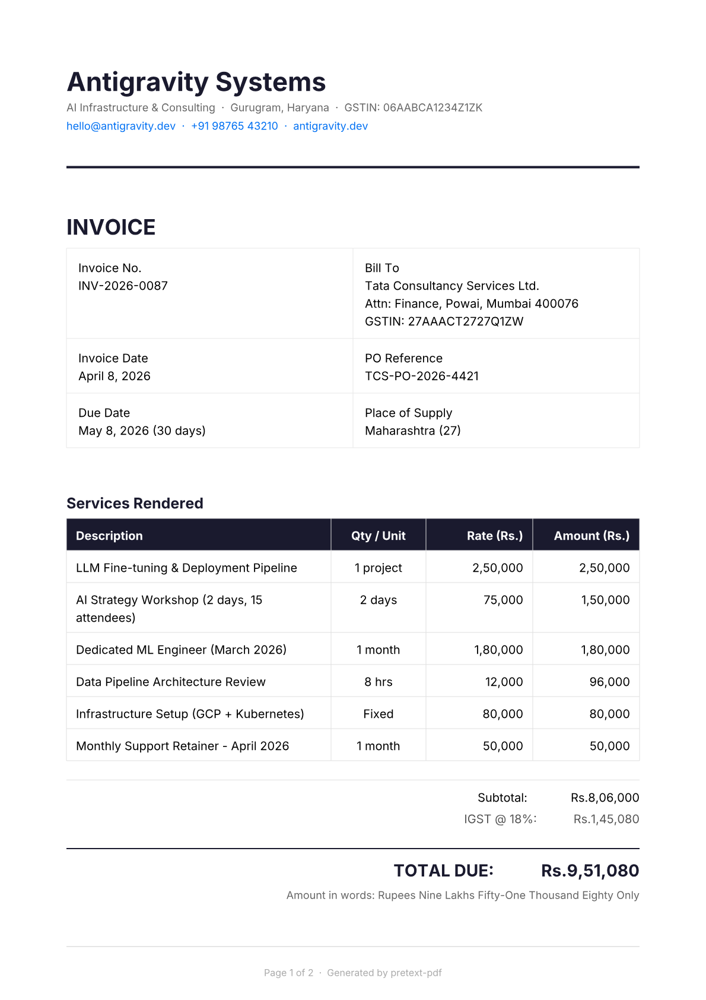
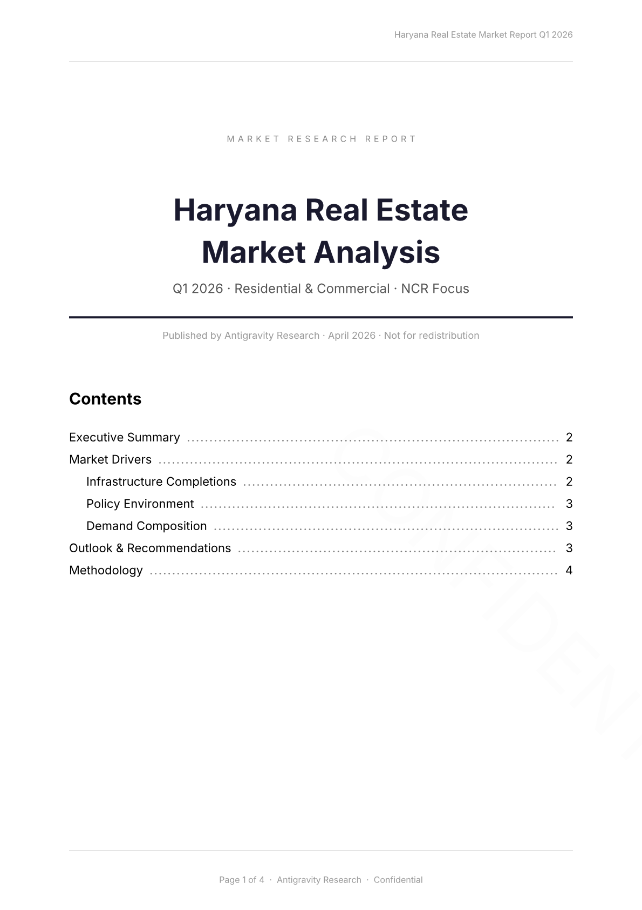
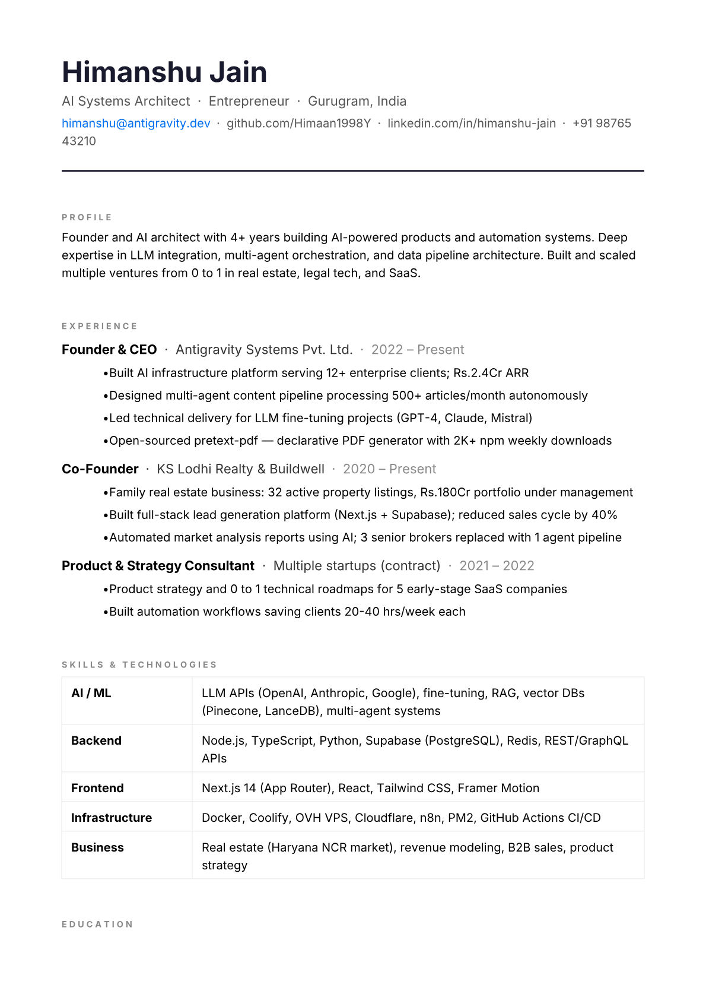

# pretext-pdf

> **Declarative JSON → PDF generation with professional typography.**
>
> Build sophisticated, multi-page documents with precise text layout, international support, and zero browser overhead.

[](https://www.npmjs.com/package/pretext-pdf)
[](https://www.npmjs.com/package/pretext-pdf)
[](https://github.com/Himaan1998Y/pretext-pdf/actions)
[](https://www.typescriptlang.org/)
[](#type-safety-v046)
[](#test-coverage)
[](LICENSE)

**[Try the Live Demo](https://stackblitz.com/github/Himaan1998Y/pretext-pdf/tree/master/demo/stackblitz?file=public%2Findex.html)** — edit JSON, generate PDFs instantly. No install required.

**Coming from pdfmake?** See the [Migration Guide](docs/MIGRATION_FROM_PDFMAKE.md) — maps every pdfmake pattern to its pretext-pdf equivalent.

---

## v0.8.0 — QR Codes, Barcodes, Charts, Markdown, Templates

Five new capabilities added, all via optional peer dependencies (zero extra weight if unused):

- **`qr-code` element** — embed scannable QR codes (UPI payments, URLs, vCards). Requires `qrcode`.
- **`barcode` element** — 100+ symbologies (EAN-13, Code128, PDF417, QR, DataMatrix…). Requires `bwip-js`.
- **`chart` element** — embed Vega-Lite data visualisations as crisp vector SVG. Requires `vega` + `vega-lite`.
- **`pretext-pdf/markdown`** entry point — convert any Markdown string to `ContentElement[]` in one call. Requires `marked`.
- **`pretext-pdf/templates`** entry point — zero-dep helper functions: `createInvoice`, `createGstInvoice` (India GST / IGST / CGST+SGST), `createReport`.

Install only what you need:

```bash
npm install pretext-pdf@^0.8.0
npm install qrcode              # for qr-code element
npm install bwip-js             # for barcode element
npm install vega vega-lite      # for chart element
npm install marked              # for pretext-pdf/markdown
```

> **ESM only** — pretext-pdf is a pure ESM package (`"type": "module"`). Use `import`, not `require`.

---

## v0.4.6 — Security & Quality Hardening

All 41 issues from comprehensive April 2026 security audit resolved:

- **Phase 1**: Security hardening (path traversal protection, async file I/O, explicit error handling)
- **Phase 2**: Type safety (reduced and documented any-casts, proper module typing, strict inference)
- **Phase 3**: Test coverage (false-positive fixes, boundary case validation)
- **Phase 4**: Code quality (silent failures → explicit errors, improved decoupling)

**Result**: 188+ comprehensive tests, 100% pass rate, production-ready reliability.

---

## Why pretext-pdf?

| | pdfmake | Puppeteer | **pretext-pdf** |
|---|---|---|---|
| Easy declarative API | ✅ | ❌ | ✅ |
| Professional typography | ❌ | ✅ | ✅ |
| Lightweight (no browser) | ✅ | ❌ | ✅ |
| International text (RTL/CJK) | ❌ | ✅ | ✅ |
| Pure Node.js | ✅ | ❌ | ✅ |
| Hyperlinks + annotations | ❌ | ✅ | ✅ |
| Document assembly | ❌ | ❌ | ✅ |

### Powered by [pretext](https://github.com/chenglou/pretext)

Pretext is a precision text layout engine by [Cheng Lou](https://github.com/chenglou) (React core team, Midjourney).

```
JSON descriptor  →  pretext layout  →  pdf-lib renderer  →  PDF bytes
                     (kerning,           (annotations,
                      hyphenation,        encryption,
                      RTL, CJK)           hyperlinks)
```

---

## Output Samples

Real documents generated with pretext-pdf:

| Invoice | Market Report | Resume / CV |
|---------|--------------|-------------|
| [](examples/showcase-invoice.ts) | [](examples/showcase-report.ts) | [](examples/showcase-resume.ts) |
| [View source](examples/showcase-invoice.ts) | [View source](examples/showcase-report.ts) | [View source](examples/showcase-resume.ts) |

---

## Install

```bash
npm install pretext-pdf@^0.8.0
```

> **ESM only** — use `import`, not `require`.

Optional peer dependencies — install only what you need:

```bash
npm install @napi-rs/canvas    # SVG elements (qr-code / barcode / chart all require this too)
npm install qrcode             # qr-code element
npm install bwip-js            # barcode element
npm install vega vega-lite     # chart element
npm install marked             # pretext-pdf/markdown entry point
npm install @signpdf/signpdf   # PKCS#7 cryptographic signing
```

> **Encryption is built-in since v0.4.0** — no extra install needed. Just add `encryption` to your document config.

---

## Quick Start

```typescript
import { render } from 'pretext-pdf'
import { writeFileSync } from 'fs'

const pdf = await render({
  pageSize: 'A4',
  margins: { top: 40, bottom: 40, left: 50, right: 50 },
  metadata: { title: 'My Invoice', author: 'Acme Corp' },
  content: [
    { type: 'heading', level: 1, text: 'Invoice #12345' },
    { type: 'paragraph', text: 'Thank you for your business.', fontSize: 12 },
    {
      type: 'table',
      columns: [
        { name: 'Item', width: 200 },
        { name: 'Qty', width: 50, align: 'right' },
        { name: 'Price', width: 100, align: 'right' },
      ],
      rows: [
        { Item: 'Professional Services', Qty: '10', Price: '$1,000' },
        { Item: 'Hosting (annual)', Qty: '1', Price: '$500' },
      ],
    },
    { type: 'paragraph', text: 'Total: $1,500', align: 'right', fontWeight: 700 },
  ],
})

writeFileSync('invoice.pdf', pdf)
```

### Builder API

```typescript
import { createPdf } from 'pretext-pdf'

const pdf = await createPdf({ pageSize: 'A4' })
  .addHeading('My Report', 1)
  .addText('Fluent chainable API.')
  .addTable({ columns: [{ name: 'Col A' }, { name: 'Col B' }], rows: [{ 'Col A': 'x', 'Col B': 'y' }] })
  .build()
```

---

## Agent / AI Integration

pretext-pdf works great as a tool for AI agents generating PDFs on demand.

### MCP Server (Claude Desktop, Cursor, Windsurf)

Use [`pretext-pdf-mcp`](https://www.npmjs.com/package/pretext-pdf-mcp) to call pretext-pdf directly from any AI agent:

```json
{
  "mcpServers": {
    "pretext-pdf": {
      "command": "npx",
      "args": ["-y", "pretext-pdf-mcp"]
    }
  }
}
```

Tools available: `generate_pdf`, `generate_invoice`, `generate_report`, `generate_from_markdown`, `list_element_types`

### Quick pattern for LLMs

```typescript
import { render } from 'pretext-pdf'

// Every PdfDocument is a plain JSON object — perfect for AI generation
const pdf = await render({
  metadata: { title: 'AI-Generated Report' },
  content: [
    { type: 'heading', level: 1, text: 'Summary' },
    { type: 'paragraph', text: 'Generated content here.' },
    // ... AI fills this array
  ]
})
```

### Key facts for AI agents

- `content` is an array of typed elements — each has a `type` field
- All fields are optional except `type` and element-specific required fields (e.g. `text`, `level`)
- Errors are typed: `err.code` tells you exactly what went wrong
- `render()` is fully async, safe to `await` in any context
- Works in Node.js 18+ and modern browsers (with `@napi-rs/canvas` for SVG)

### Element type reference (quick)

```
paragraph    heading(1-4)   spacer       hr           page-break
table        image          svg          list         code
blockquote   rich-paragraph callout      comment      form-field
toc          qr-code        barcode      chart
```

---

## India / GST Invoicing

pretext-pdf has built-in support for Indian invoice requirements:

- **₹ symbol** renders correctly (bundled Inter font includes the Rupee glyph)
- **Indian number formatting** — helper for 1,00,000 notation (not 100,000)
- **GST structure** — CGST/SGST (intra-state) and IGST (inter-state) table layouts
- **Amount in words** — Indian numbering system (Lakh/Crore)
- **SAC/HSN codes** — column support in line-item tables

Use the `createGstInvoice` template for a complete GST-compliant invoice in one function call:

```typescript
import { createGstInvoice } from 'pretext-pdf/templates'
import { render } from 'pretext-pdf'

const content = createGstInvoice({
  supplier: { name: 'Antigravity Systems', address: 'Gurugram, HR', gstin: '06AAACA1234A1ZV', state: 'Haryana' },
  buyer: { name: 'TechStartup Ltd', address: 'Mumbai, MH', gstin: '27AABCB5678B1ZP', state: 'Maharashtra' },
  invoiceNumber: 'INV/2026-27/001',
  invoiceDate: '20 Apr 2026',
  placeOfSupply: 'Maharashtra (27)',
  items: [
    { description: 'Software Development', hsnSac: '998314', quantity: 80, unit: 'Hrs', rate: 3000, taxRate: 18 },
  ],
  isInterState: true,            // auto-detected from state fields if omitted
  qrUpiData: 'upi://pay?pa=merchant@hdfc&pn=Antigravity&am=283200',
  bankName: 'HDFC Bank', accountNumber: '501001234567', ifscCode: 'HDFC0001234',
})
const pdf = await render({ content })
```

See [`examples/gst-invoice-india.ts`](examples/gst-invoice-india.ts) for the raw element approach.

---

## Markdown → PDF (`pretext-pdf/markdown`)

Convert any Markdown string to a `pretext-pdf` document in one call. Requires `marked` peer dep.

```typescript
import { markdownToContent } from 'pretext-pdf/markdown'
import { render } from 'pretext-pdf'
import { writeFileSync } from 'fs'

const md = `
# Q1 2026 Report

Revenue grew **18%** year-over-year, driven by:

- Cloud services (+32%)
- Enterprise licenses (+12%)

> All figures are in USD millions.
`

const content = await markdownToContent(md, {
  codeFontFamily: 'Courier New',  // enables fenced code block rendering
})
const pdf = await render({ content })
writeFileSync('report.pdf', pdf)
```

Supported Markdown: headings h1–h4, bold, italic, strikethrough, inline code, links, ordered/unordered lists (2 levels), fenced code blocks, blockquotes, horizontal rules.

---

## Invoice & Report Templates (`pretext-pdf/templates`)

Pre-built zero-dependency template functions that generate `ContentElement[]` arrays:

```typescript
import { createInvoice, createGstInvoice, createReport } from 'pretext-pdf/templates'
import { render } from 'pretext-pdf'

// Generic invoice (any currency)
const invoiceContent = createInvoice({
  from: { name: 'Acme Corp', address: '123 Main St', email: 'billing@acme.com' },
  to: { name: 'Client Ltd', address: '456 Oak Ave' },
  invoiceNumber: 'INV-2026-001', date: '2026-04-20',
  items: [{ description: 'Consulting', quantity: 10, unitPrice: 150 }],
  currency: '$', taxRate: 10, taxLabel: 'GST',
  qrData: 'upi://pay?pa=acme@bank&am=1650',
})

// Research report with optional TOC
const reportContent = createReport({
  title: 'Annual Performance Report',
  author: 'Finance Team', date: 'April 2026',
  abstract: 'Revenue grew 18% YoY across all segments.',
  includeTableOfContents: true,
  sections: [
    { title: 'Revenue', paragraphs: ['Cloud +32%, Enterprise +12%.'], bullets: ['SaaS: $2.8M', 'Services: $1.1M'] },
  ],
})

const pdf = await render({ content: reportContent })
```

---

## Features

### Security & Reliability

- ✅ **Type-safe architecture** — strict TypeScript inference, documented casts for pdf-lib internals
- ✅ **Cryptographically signed PDFs** — PKCS#7 signing support (Phase 3)
- ✅ **Path traversal protection** — Secure file operations with validated paths
- ✅ **Error sanitization** — No sensitive data in error messages
- ✅ **Async-safe I/O** — Non-blocking file operations throughout
- ✅ **Comprehensive test coverage** — 188+ tests with 100% pass rate
- ✅ **No hardcoded secrets** — Environment-based configuration

### Element Types

| Element | What it does |
| --- | --- |
| `paragraph` | Text block — font, size, color, align, background, letterSpacing, smallCaps, tabularNumbers, multi-column (`columns` + `columnGap`), RTL (`dir`) |
| `heading` | H1–H4 with bookmarks, URL links, internal anchors, tabularNumbers, RTL (`dir`) |
| `table` | Fixed/proportional columns, colspan, rowspan, repeating headers across page breaks |
| `image` | PNG/JPG/WebP with sizing, alignment, float left/right with `floatText` or rich `floatSpans` (mixed-format caption) |
| `list` | Ordered/unordered, 2-level nesting, `nestedNumberingStyle: 'restart' \| 'continue'` |
| `code` | Monospace block with background and padding |
| `blockquote` | Left border + background |
| `rich-paragraph` | Mixed bold/italic/color/size/super/subscript spans with inline hyperlinks |
| `svg` | Embedded SVG graphics with auto-sizing from viewBox |
| `toc` | Auto-generated table of contents with accurate page numbers (two-pass) |
| `qr-code` | Scannable QR code — UPI payment links, URLs, vCards. `data`, `size`, `errorCorrectionLevel`, `foreground`/`background` color. Requires `qrcode` peer dep. |
| `barcode` | 100+ symbologies — EAN-13, Code128, PDF417, DataMatrix, and more via `symbology` field. Requires `bwip-js` peer dep. |
| `chart` | Vega-Lite data visualisation — pass any valid Vega-Lite spec to `spec`. Rendered as vector SVG. Requires `vega` + `vega-lite` peer deps. |
| `comment` | PDF sticky-note annotation (visible in Acrobat/Preview sidebar) |
| `hr` | Horizontal rule |
| `spacer` | Fixed-height gap |
| `page-break` | Force new page |

### Document Features

| Feature | Config key | Notes |
| --- | --- | --- |
| Watermarks | `doc.watermark` | Text or image, opacity, rotation |
| Encryption | `doc.encryption` | Password + granular permissions |
| PDF Bookmarks | `doc.bookmarks` | Auto-generated from headings |
| Hyphenation | `doc.hyphenation` | Liang's algorithm, `language: 'en-us'` |
| Headers/Footers | `doc.header` / `doc.footer` | `{{pageNumber}}`, `{{totalPages}}`, `{{date}}`, `{{author}}` tokens |
| Per-section overrides | `doc.sections` | Different header/footer/margins per page range |
| Metadata | `doc.metadata` | Title, author, subject, keywords, `language` (PDF /Lang), `producer` |

### Phase 8 Features

| Feature | API |
| --- | --- |
| **Hyperlinks** | `paragraph.url`, `heading.url`, `heading.anchor`, `span.href` |
| **Inline formatting** | `span.verticalAlign: 'superscript'\|'subscript'`, `paragraph.letterSpacing`, `heading.smallCaps` |
| **Sticky notes** | `{ type: 'comment', contents: '...' }`, `paragraph.annotation` |
| **Document assembly** | `merge(pdfs)`, `assemble(parts)` |
| **Interactive forms** | `{ type: 'form-field', fieldType: 'text'\|'checkbox'\|'radio'\|'dropdown'\|'button' }`, `doc.flattenForms` |
| **Signature placeholder** | `doc.signature: { signerName, reason, location, x, y, page }` |
| **Callout boxes** | `{ type: 'callout', content, style: 'info'\|'warning'\|'tip'\|'note', title }` |
| **Form error handling** | `doc.onFormFieldError: (name, err) => 'skip' \| 'throw'` |
| **Image error handling** | `doc.onImageLoadError: (src, err) => 'skip' \| 'throw'` |

### Type Safety (v0.4.6+)

pretext-pdf is built with **strict TypeScript**. Remaining `as any` casts are limited to pdf-lib internal APIs with no public type surface, each documented with a comment explaining why:

- **Full type inference** — No need to cast document configs or response types
- **Element validation** — TypeScript catches invalid element types at compile time
- **API contract testing** — Every API boundary has comprehensive type tests
- **Error types** — `PretextPdfError` with typed code field for safe error handling
- **Module typing** — Complete type definitions for all exports and configurations

---

## Security Audit (April 2026)

Comprehensive security and quality audit completed. **41 issues identified and fixed across 5 phases:**

| Phase | Focus | Issues | Status |
| --- | --- | --- | --- |
| 0 | Core rendering | Footnote truncation | ✅ Fixed |
| 1 | Security hardening | Path validation, async I/O, error handling | ✅ Fixed |
| 2 | Type safety | Any-cast elimination, module typing | ✅ Fixed |
| 3 | Test coverage | False-positives, boundary cases, crypto signing | ✅ Fixed |
| 4 | Code quality | Silent failures → explicit errors, decoupling | ✅ Fixed |

**Audit results:**

- Zero path traversal vulnerabilities
- All error messages sanitized (no data leaks)
- Async file I/O throughout (non-blocking)
- No hardcoded secrets or credentials
- 188+ tests, 100% pass rate
- Production-ready reliability

See [SECURITY.md](SECURITY.md) for detailed security policies.

---

## Examples

Run working examples from the `examples/` directory:

```bash
# v0.8.0 new element examples (install optional deps first)
# npm install qrcode bwip-js vega vega-lite marked

# QR code in a document:
# content: [{ type: 'qr-code', data: 'upi://pay?pa=merchant@upi&am=1000', size: 80, align: 'center' }]

# Barcode:
# content: [{ type: 'barcode', symbology: 'ean13', data: '5901234123457', width: 200, height: 80 }]

# Vega-Lite chart:
# content: [{ type: 'chart', spec: { data: { values: [...] }, mark: 'bar', encoding: { x: ..., y: ... } } }]

# Phase 7 examples
npm run example                # Basic invoice
npm run example:watermark      # Text/image watermarks
npm run example:bookmarks      # PDF outline/bookmarks
npm run example:toc            # Auto table of contents
npm run example:rtl            # Arabic/Hebrew RTL text
npm run example:encryption     # Password-protected PDF

# Phase 8 examples
npm run example:hyperlinks     # External links, email links, internal anchors
npm run example:annotations    # Sticky notes on elements
npm run example:assembly       # Merge and assemble multiple PDFs
npm run example:inline         # Superscript, subscript, letter-spacing, small-caps
npm run example:forms          # Interactive form fields (text, checkbox, radio, dropdown)
npm run example:callout        # Callout boxes (info, warning, tip, note presets)
```

All examples write output to `output/*.pdf`.

---

## API Reference

### `render(doc): Promise<Uint8Array>`

```typescript
import { render } from 'pretext-pdf'

const pdf = await render({
  pageSize: 'A4',          // 'A4' | 'A3' | 'A5' | 'Letter' | 'Legal' | [w, h]
  margins: { top: 72, bottom: 72, left: 72, right: 72 },
  defaultFont: 'Inter',    // Inter 400 bundled; load others via doc.fonts
  defaultFontSize: 12,
  metadata: {
    title: 'Document Title',
    author: 'Author Name',
    subject: 'Description',
    keywords: ['pdf', 'report'],
  },
  watermark: { text: 'DRAFT', opacity: 0.15, rotation: -45 },
  encryption: { userPassword: 'open', ownerPassword: 'admin', permissions: { printing: true, copying: false } },
  bookmarks: { minLevel: 1, maxLevel: 3 },
  hyphenation: { language: 'en-us', minWordLength: 6 }, // ⚠️ Use lowercase: 'en-us' not 'en-US' — matches the npm package name hyphenation.en-us
  header: { text: 'My Document — {{pageNumber}} of {{totalPages}}', align: 'right' },
  footer: { text: 'Confidential', align: 'center', color: '#999999' },
  content: [ /* ContentElement[] */ ],
})
```

### `merge(pdfs): Promise<Uint8Array>`

Combine pre-rendered PDFs:

```typescript
import { merge } from 'pretext-pdf'

const combined = await merge([coverPdf, bodyPdf, appendixPdf])
```

### `assemble(parts): Promise<Uint8Array>`

Mix new document configs with existing PDFs:

```typescript
import { assemble } from 'pretext-pdf'

const report = await assemble([
  { pdf: existingCoverPdf },
  { doc: { content: [...] } },   // rendered fresh
  { pdf: standardTermsPdf },
])
```

---

## Error Handling

Every error throws `PretextPdfError` with a typed code:

```typescript
import { render, PretextPdfError } from 'pretext-pdf'

try {
  const pdf = await render(config)
} catch (err) {
  if (err instanceof PretextPdfError) {
    switch (err.code) {
      case 'VALIDATION_ERROR':   // Invalid config
      case 'FONT_LOAD_FAILED':   // Font file not found
      case 'IMAGE_TOO_TALL':     // Image doesn't fit on page
      case 'ASSEMBLY_EMPTY':     // merge/assemble called with empty array
      // ... see CHANGELOG.md for full list
    }
  }
}
```

---

## Troubleshooting

### Hyphenation language not found

```
UNSUPPORTED_LANGUAGE: Language 'en-US' not supported
```

Use **lowercase** language codes that match the npm package name:

```typescript
// Wrong — 'en-US' fails on Linux (case-sensitive filesystem)
hyphenation: { language: 'en-US' }

// Correct — matches 'hyphenation.en-us' package name
hyphenation: { language: 'en-us' }
```

### Encryption

Encryption is built-in since v0.4.0. Add `encryption` to your document config:

```typescript
const pdf = await render({
  encryption: {
    userPassword: 'open123',
    ownerPassword: 'admin456',
    permissions: { printing: true, copying: false, modifying: false }
  },
  content: [...]
})
```

### SVG rendering requires optional dependency

Install `@napi-rs/canvas` for SVG support:

```bash
npm install @napi-rs/canvas
```

### PDF is blank or too small

Check margins — if left+right margins exceed page width, content width becomes negative:

```typescript
// For narrow pages, reduce margins:
margins: { top: 36, bottom: 36, left: 36, right: 36 }
```

### Form fields not interactive after flattenForms

`flattenForms: true` bakes fields into static content — by design. Remove it to keep interactive.

---

## Test Coverage

598+ tests across all phases with 100% pass rate:

```bash
npm test              # Full suite (unit + e2e + all phases including v0.8.0)
npm run test:unit     # Validation, builder, rich-text unit tests
npm run test:e2e      # End-to-end render tests
npm run test:10a      # QR code + barcode tests
npm run test:10b      # Vega-Lite chart tests
npm run test:10c      # Markdown converter tests
npm run test:10d      # Template function tests
npm run test:phases   # All phase tests (7–11, performance, signatures)
```

**Coverage**: Type safety, path validation, error handling, boundary cases, crypto signing, document assembly, all content elements, optional-dep error codes, MCP tool validation.

---

## Custom Fonts

```typescript
const pdf = await render({
  fonts: [
    { family: 'Roboto', weight: 400, src: '/path/to/Roboto-Regular.ttf' },
    { family: 'Roboto', weight: 700, src: '/path/to/Roboto-Bold.ttf' },
    { family: 'Roboto', style: 'italic', src: '/path/to/Roboto-Italic.ttf' },
  ],
  defaultFont: 'Roboto',
  content: [
    { type: 'paragraph', text: 'Uses Roboto font' },
    { type: 'paragraph', text: 'Bold text', fontWeight: 700 },
  ],
})
```

---

## Rich Text

```typescript
{
  type: 'rich-paragraph',
  fontSize: 13,
  spans: [
    { text: 'Normal ' },
    { text: 'bold', fontWeight: 700 },
    { text: ' and ', fontStyle: 'italic' },
    { text: 'colored', color: '#e63946' },
    { text: ' and ' },
    { text: 'linked', href: 'https://example.com', underline: true, color: '#0070f3' },
    { text: '. Also: E=mc' },
    { text: '2', verticalAlign: 'superscript' },
    { text: ' and H' },
    { text: '2', verticalAlign: 'subscript' },
    { text: 'O.' },
  ],
}
```

---

## Footnotes

Use `createFootnoteSet()` to generate matched reference/definition pairs with guaranteed unique IDs:

```typescript
import { render, createFootnoteSet } from 'pretext-pdf'

const notes = createFootnoteSet([
  { text: 'Smith, J. (2022). Typography in PDFs.' },
  { text: 'Ibid., p. 42.' },
])

await render({
  content: [
    {
      type: 'rich-paragraph',
      spans: [
        { text: 'See the original research' },
        { text: '¹', verticalAlign: 'superscript', footnoteRef: notes[0]!.id },
        { text: ' for details.' },
      ],
    },
    ...notes.map(n => n.def),  // footnote-def elements go at end of document
  ],
})
```

---

## Roadmap

| Phase | Feature | Status |
|-------|---------|--------|
| 1–4 | Core engine, pagination, typography | ✅ |
| 5 | Rich text / builder API | ✅ |
| 6 | Headers/footers, columns, decoration | ✅ |
| 7A | PDF Bookmarks / Outline | ✅ |
| 7B | Watermarks | ✅ |
| 7C | Hyphenation | ✅ |
| 7D | Table of Contents | ✅ |
| 7E | SVG support | ✅ |
| 7F | RTL text (Arabic/Hebrew) | ✅ |
| 7G | Encryption | ✅ |
| 8A | Sticky note annotations | ✅ |
| 8B | Interactive forms (text/checkbox/radio/dropdown/button) | ✅ |
| 8C | Document assembly (merge + assemble) | ✅ |
| 8D | Callout boxes (info/warning/tip/note) | ✅ |
| 8E | Signature placeholder | ✅ |
| 8F | Document metadata (language, producer) | ✅ |
| 8G | Hyperlinks | ✅ |
| 8H | Inline formatting (super/subscript, letterSpacing, smallCaps) | ✅ |
| 9A | Digital signatures (cryptographic, PKCS#7) | 🔜 |
| 9B | Image floats (text flowing around images) | 🔜 |
| 9C | Font subsetting pre-computation | 🔜 |

---

## Performance

Benchmarked on Windows 11 / Node 22 / Intel i7-12th Gen. Numbers are averages over 10 runs, excluding the first cold JIT run.

| Document | Render time | PDF size |
| --- | --- | --- |
| 1 page (heading + paragraph + list) | ~220 ms | ~45 KB |
| 10 pages (40 sections, mixed elements) | ~1,100 ms | ~180 KB |
| Mixed (heading + paragraph + 20-row table + list + hr) | ~290 ms | ~60 KB |

**Font subsetting** is automatic for TTF/OTF fonts. Only the glyphs used in the document are embedded, typically reducing PDF size by 40–60% compared to full font embedding. A typical single-font invoice renders under 65 KB. WOFF2 fonts are embedded without subsetting due to an upstream library limitation.

For large documents (10,000+ elements), set `NODE_OPTIONS=--max-old-space-size=4096` to prevent GC pressure.

---

## Migration from pdfmake

Coming from pdfmake? See the **[Migration Guide](docs/MIGRATION_FROM_PDFMAKE.md)** for a complete cheat sheet covering every common pdfmake pattern and its pretext-pdf equivalent.

---

## Contributing

See [CONTRIBUTING.md](CONTRIBUTING.md). TDD approach — write tests first.

---

## License

[MIT](LICENSE)

---

## Credits

Built by [Himanshu Jain](https://github.com/Himaan1998Y) on top of:
- **[pretext](https://github.com/chenglou/pretext)** — Text layout engine (Cheng Lou)
- **[pdf-lib](https://github.com/Hopding/pdf-lib)** — PDF manipulation
- **[@napi-rs/canvas](https://github.com/napi-rs/canvas)** — Server-side Canvas API for Node.js

Questions? [Open an issue](https://github.com/Himaan1998Y/pretext-pdf/issues)
