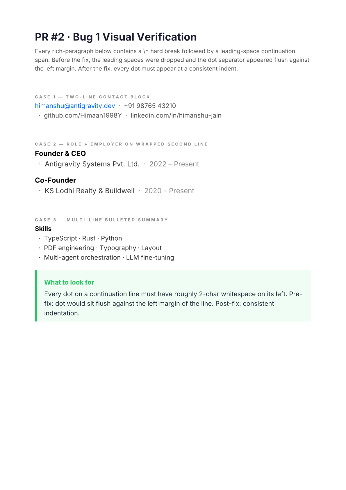
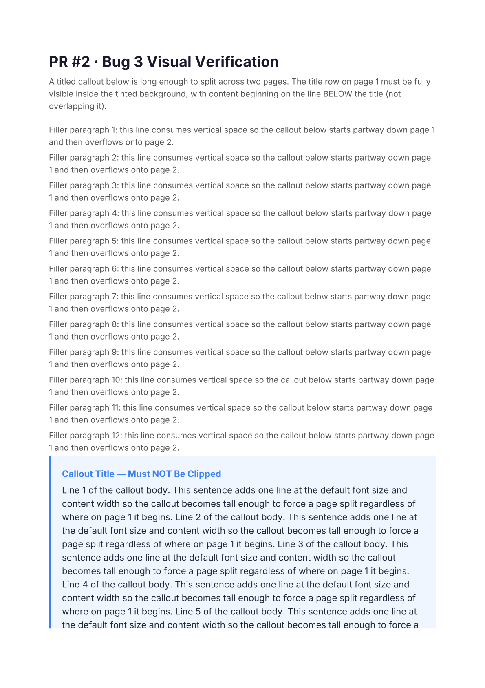
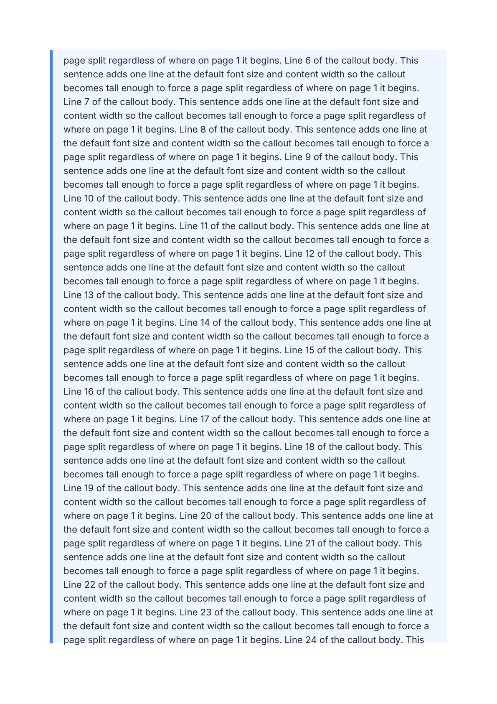

# PR #2 — Visual Verification Screenshots

PNG renders produced from [examples/visual-pr2-bug1-separator.ts](../../../examples/visual-pr2-bug1-separator.ts)
and [examples/visual-pr2-bug3-callout-split.ts](../../../examples/visual-pr2-bug3-callout-split.ts).

## Bug 1 — Leading-space preserved after hard break



Every `·` on a continuation line (after a `\n` hard break) shows with leading
whitespace. Pre-fix, the leading space was dropped and `·` appeared flush
against the left margin.

## Bug 3 — Titled callout background covers title across page split

### Page 1



### Page 2



### Page 3


Page 1: the title row `Callout Title — Must NOT Be Clipped` is fully visible
inside the tinted background, and body content begins on the line below.
Pre-fix, extra content lines were packed into the title's reserved space,
causing the body to overdraw the title.

Page 2: the continuation chunk starts at the top of the page. No title is
redrawn. Background fills the full width.

Page 3: callout body ends. The trailing paragraph sits below the callout
background (not inside it), confirming y-tracking on the continuation chunk
correctly accounts for the title row reservation on page 1.

## Reproducing

```bash
npm run build
npx tsx examples/visual-pr2-bug1-separator.ts
npx tsx examples/visual-pr2-bug3-callout-split.ts
# PDFs land in test-output/ (gitignored)
```
