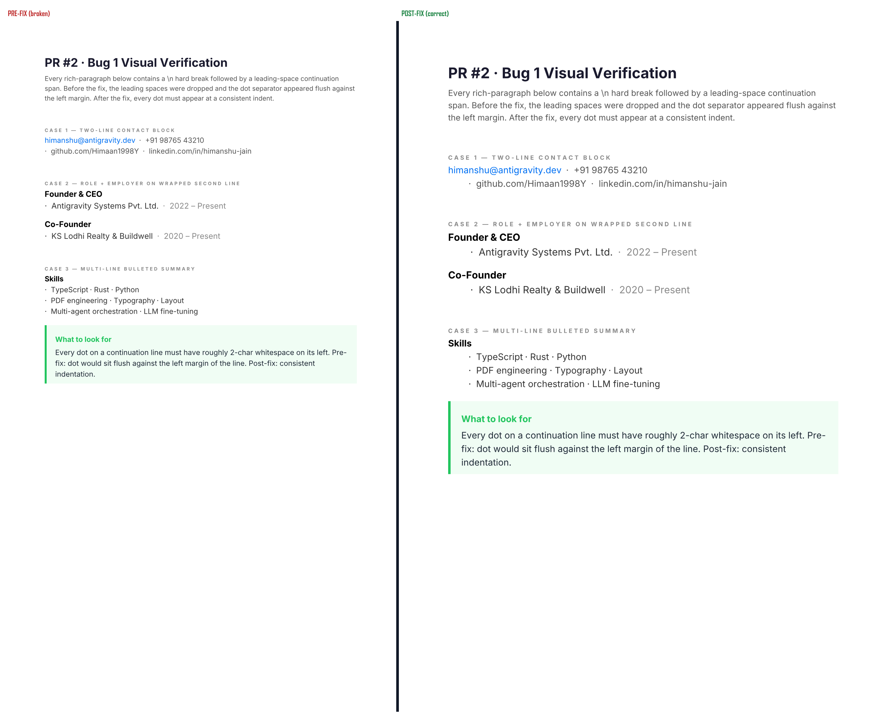
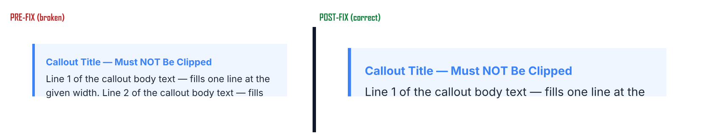

# PR #2 — Visual Verification (A/B evidence)

Side-by-side renders produced from
[examples/visual-pr2-bug1-separator.ts](../../../examples/visual-pr2-bug1-separator.ts)
and
[examples/visual-pr2-bug3-callout-split.ts](../../../examples/visual-pr2-bug3-callout-split.ts),
rendered against both the pre-fix commit (`bb33bcc`, v0.9.0 master before PR #2)
and the post-fix head, stitched together by [`test-output/_compose.mjs`](../../../test-output/_compose.mjs).

## Bug 1 — leading-space preserved after hard break



**Left (pre-fix, broken):** continuation lines after a `\n` hard break have
their leading-space tokens dropped. The `·` separator sits flush against the
left margin of the wrapped line.

**Right (post-fix, correct):** the 8-space leading run is preserved; every `·`
renders at its intended ~25-pt indent.

### Measurement-level evidence

Measured via `measureBlock` on the exact span sequence
`[{ text: 'Founder & CEO' }, { text: '\\n  ·  Antigravity Systems Pvt. Ltd.' }, { text: '  ·  2022 – Present' }]`:

| Fragment | PRE-fix x | POST-fix x |
|---|---|---|
| `'Founder '` | 0.00 | 0.00 |
| `'& '` | 47.15 | 47.15 |
| `'CEO'` | 57.14 | 57.14 |
| (line break) | — | — |
| leading `'  '` | *(dropped)* | 0.00 |
| `'·  '` | **0.00** | **6.19** |
| `'Antigravity '` | 9.36 | 15.55 |

The leading-whitespace fragment that pre-fix dropped is preserved post-fix,
shifting every downstream fragment ~6 pt to the right.

## Bug 3 — titled callout background covers title across page split



**Left (pre-fix, broken):** the paginator packed 2 content lines onto page 1
without reserving space for the title row. The background rect was sized for
title + 1 line; line 2 renders BELOW the tint on white background.

**Right (post-fix, correct):** only 1 content line fits on page 1 with the
title row correctly reserved. Background, title, and body all stay in sync;
line 2 flows to page 2.

### Paginator-level evidence

Same callout block, `pageContentHeight = 60pt` (regression-test geometry):

|  | PRE-fix | POST-fix |
|---|---|---|
| `block.lines` | 3 | 3 |
| page 1 chunk | startLine=0, endLine=**3** (3 lines crammed) | startLine=0, endLine=**2** (title reserved) |
| pages total | 1 page (overflow hidden by the background-rect clip) | 2 pages |

Pre-fix `endLine=3` on a 60-pt page is the bug: `availableForLines` was
`60 - 10 - 10 = 40pt`, and `floor(40 / 18lh) = 2 lines` plus the title's
own `titleHeight` sneaking in uncounted. Post-fix `availableForLines =
40 - 21(titleH) = 19pt → floor = 1 line`, which is the correct reservation.

## Full post-fix renders (single-page references)

- [bug1-post-full.png](bug1-post-full.png) — full post-fix Bug 1 document (all three CASE blocks)
- [bug3-post-p1.png](bug3-post-p1.png) — post-fix Bug 3 page 1 (title + line 1 inside tint)
- [bug3-post-p2.png](bug3-post-p2.png) — post-fix Bug 3 page 2 (continuation chunk)

## Reproducing

```bash
# post-fix renders (this worktree)
npm run build
npx tsx examples/visual-pr2-bug1-separator.ts
npx tsx examples/visual-pr2-bug3-callout-split.ts
node test-output/_convert.mjs     # PDFs → PNGs

# pre-fix renders (create a worktree at the pre-fix commit, then repeat)
git worktree add /tmp/pretext-prefix bb33bcc

# A/B composite
node test-output/_compose.mjs     # pre+post → side-by-side
```
